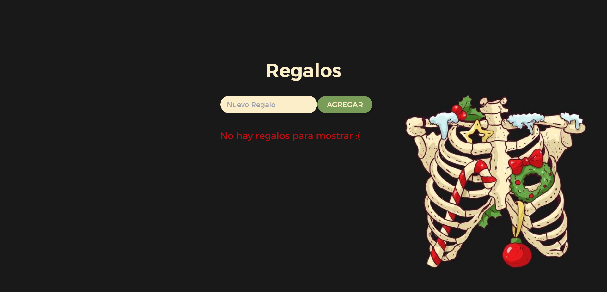
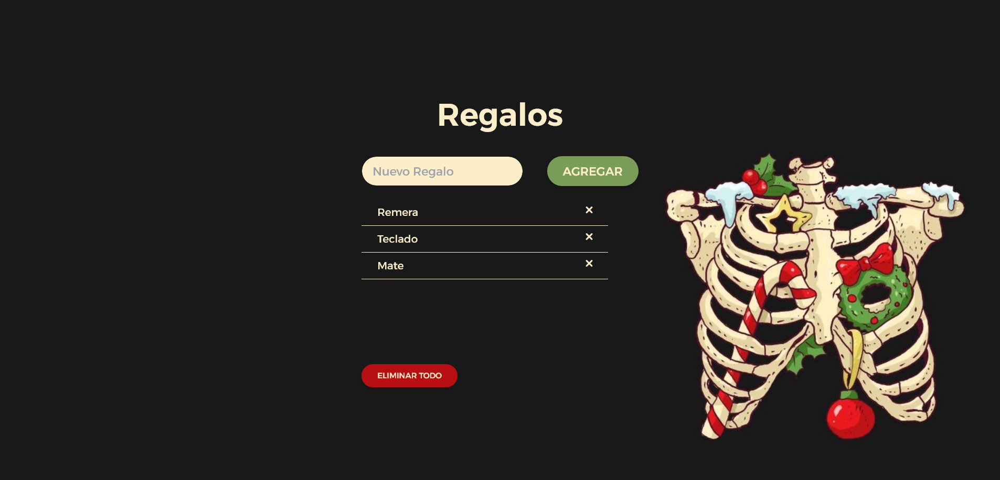
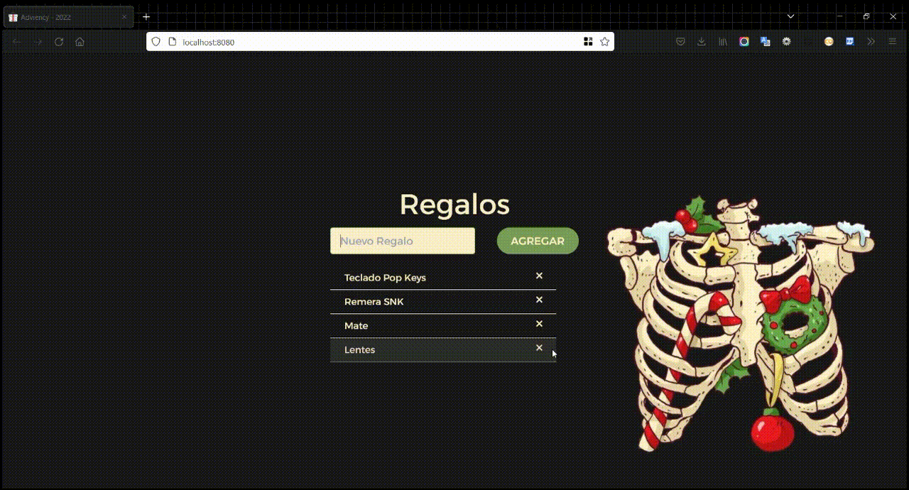
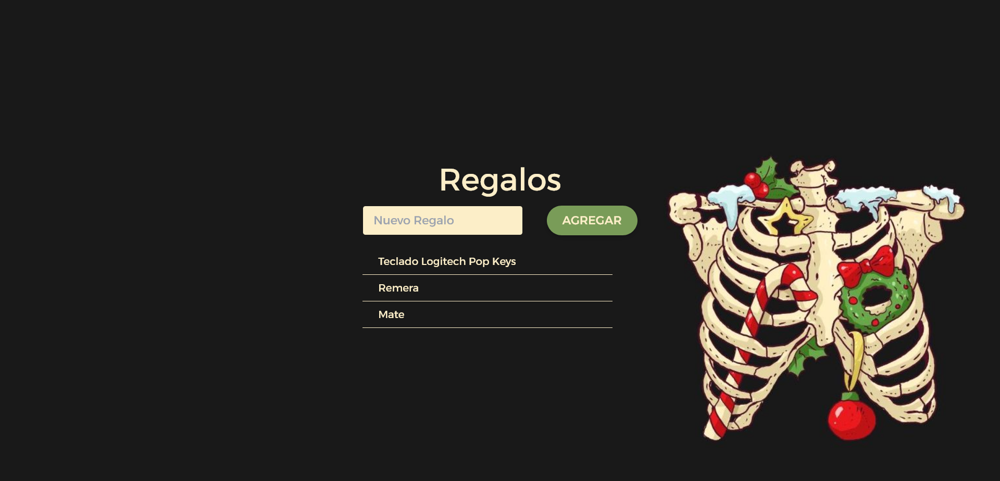
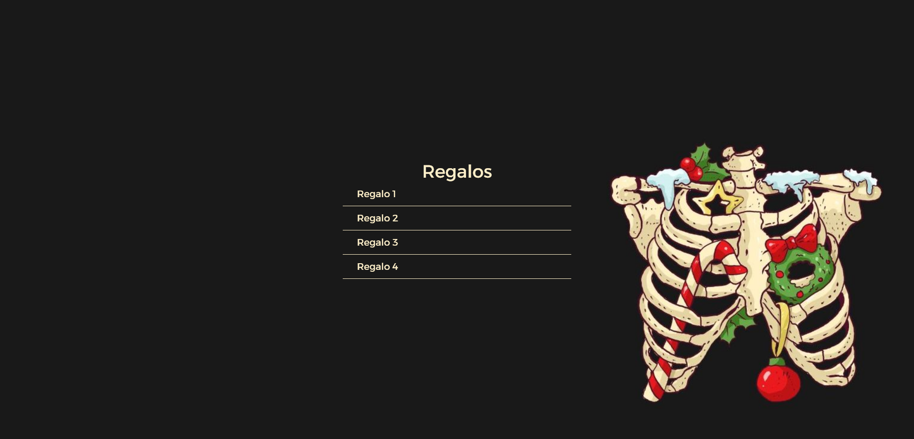
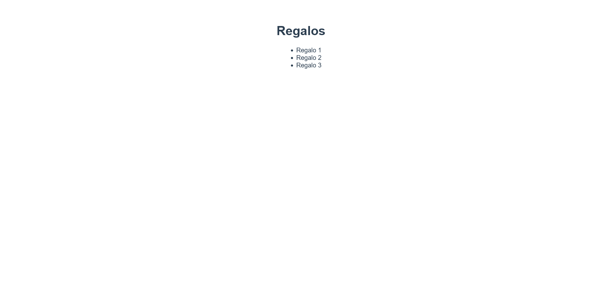

# Calendario de adviency 🎅🏽🎄

 
Challenge de [Gonzalo Pozzo](https://github.com/goncy)

---

##### Instrucciones:

**Día 6**: Nuestra aplicación no se ve muy bien cuando no hay regalos, agreguemos un mensaje alentando a agregar regalos cuando no haya ninguno!

Día 6 completado ✔ (_8/12/2022_)

- Vue3
- Tailwind CSS

**Día 5**: La gente está muy indecisa y agrega muchos regalos y después los debe borrar de a uno! Agreguemos un botón para eliminar todos los regalos a la vez!

Día 5 completado ✔ (_6/12/2022_)

- Vue3
- Tailwind CSS

---

**Día 4**: Papa noel no estuvo muy contento con la demanda de regalos, vamos a tener que agregar un botón de eliminar a cada elemento para poder borrarlos individualmente.

Día 4 completado ✔ (_4/12/2022_)

- Vue3
- Tailwind CSS

---

**Día 3**: Estámos generosos, vamos a agregar un formulario con un input para escribir nuestro regalo y un botón para agregarlo a nuestra lista, todavía no los podemos borrar, pero... es navidad! Por que querríamos borrar regalos?

Día 3 completado ✔ (_4/12/2022_)

- Vue3
- Tailwind CSS

---

**Día 2**: Nuestra app se ve muy poco navideña, demosle unos colores más lindos, rojo, verde, amarillo! Podemos ponernos creativos con lo que queramos!

Día 2 completado ✔ (_2/12/2022_)

- Vue3
- Tailwind css

---

**Día 1**: Para calentar motores vamos a mantener las cosas simples, mostremos una lista de regalos, 3 elementos, fijos, sin nada más.

Día 1 completado ✔ (_1/12/2022_)

- Vue3

